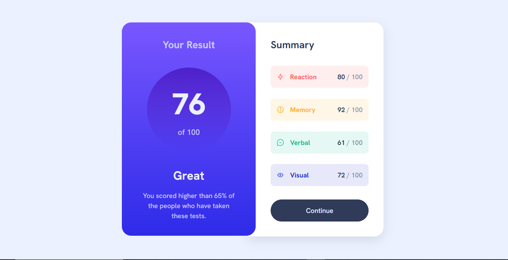
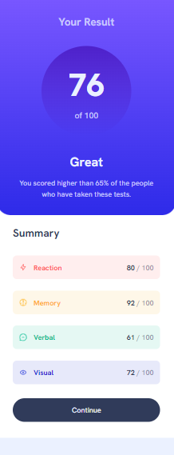

# Frontend Mentor - Results summary component solution

### Screenshot

<h1>Desktop</h1>

  

<h1>Mobile</h1>

### Links

- Solution URL: [https://github.com/CodeChd/results-summary](https://github.com/CodeChd/results-summary)
- Live Site URL: [https://results-summary-cj.netlify.app/](https://results-summary-cj.netlify.app/)

## My process

### Built with

- Semantic HTML5 markup
- CSS custom properties
- Flexbox
- CSS Grid
- [React](https://reactjs.org/) - JS library

### What I learned

As I was working on this design, I was having trouble getting the circle inside the "Your Result" container to fade out because I was attempting to add a box shadow and a pseudo element. However, after some research, I discovered that there is a straightforward method using the linear gradient property that involves using transparency at the bottom and the color that is specified in this challenge.

